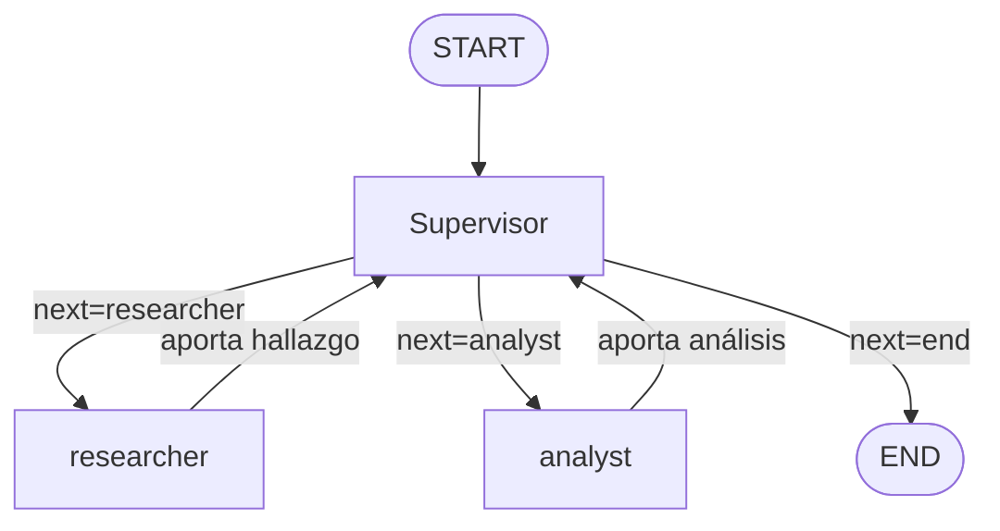
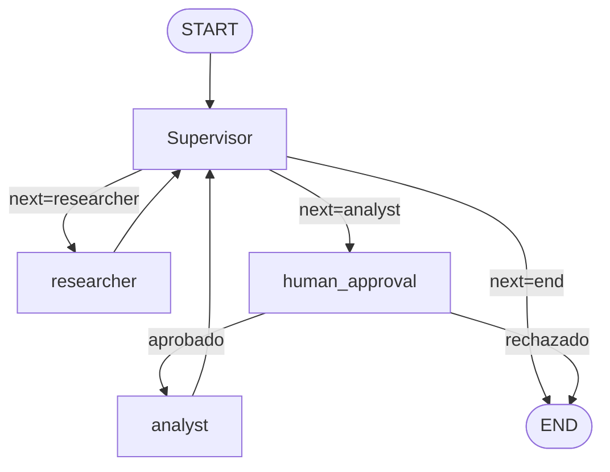

# AI Engineering: entrega acumulativa — Módulos 1 a 6

Este repositorio reúne las seis pre-entregas del curso en una evolución
progresiva: comienza con clientes LLM intercambiables, agrega procesamiento
estructurado con LangChain, construye un RAG local, migra la recuperación a
Pinecone Serverless, agrega un agente ReAct cíclico con memoria SQLite y
culmina con un orquestador multi-agente jerárquico que reutiliza ese RAG
local como base de conocimiento de un especialista.

El corpus de los módulos 3 y 4 es la Ley chilena N.º 21.442 de Copropiedad
Inmobiliaria, organizada en cuatro documentos temáticos dentro de `data/`.

## Resumen de los cinco módulos

| Módulo | Objetivo | Implementación principal | Ejecución |
| --- | --- | --- | --- |
| 1 | Abstraer el acceso a distintos proveedores LLM | Clientes asíncronos para OpenAI, Anthropic y OpenRouter, Factory y streaming | `python module1_demo.py` |
| 2 | Transformar texto libre en datos validados | Cadena LCEL, salida estructurada Pydantic, reintentos y logging | `python main.py` |
| 3 | Construir un RAG local completo | Ingesta, ChromaDB persistente, recuperación, generación grounded y referencias | `python ingest.py` y `python demo_rag.py` |
| 4 | Escalar y evaluar la recuperación | Pinecone Serverless, namespaces, BM25 + vectores y Precision@5/Recall@5 | `python init_pinecone.py`, `python ingest_pinecone.py` y `python evaluate.py` |
| 5 | Razonar, usar herramientas y recordar sesiones | `StateGraph`, `MessagesState`, `ToolNode`, `tools_condition` y `AsyncSqliteSaver` | `python -m cyclic_agent "..." --thread-id demo` |
| 6 | Orquestar especialistas bajo un Supervisor | `StateGraph` jerárquico, aristas condicionales, estado compartido con aportes trazables y techo de pasos | `python demo_orchestrator.py` |
| 7 | Exponer el orquestador como API de producción | FastAPI asíncrona, cola en background, `AsyncRedisSaver`, pausa Human-in-the-loop con `interrupt()` y trazas a LangSmith/Phoenix | `uvicorn app.main:app --reload` |

```text
Módulo 1       Módulo 2       Módulo 3       Módulo 4       Módulo 5       Módulo 6       Módulo 7
clientes LLM -> LCEL estruct. -> RAG local  -> RAG cloud  -> agente ReAct -> orquestador -> API + HITL
Factory/async   Pydantic         ChromaDB       Pinecone      SQLite/thread  Supervisor     Redis/trazas
```

## Módulo 1 — Clientes LLM multi-proveedor

El primer módulo crea una interfaz común para conversar con distintos
proveedores sin acoplar la aplicación a un SDK concreto.

Componentes:

- `llm_clients/base.py`: contrato abstracto compartido;
- `llm_clients/openai_client.py`: cliente asíncrono de OpenAI;
- `llm_clients/anthropic_client.py`: cliente asíncrono de Anthropic;
- `llm_clients/openrouter_client.py`: cliente OpenAI-compatible de OpenRouter;
- `llm_clients/factory.py`: selecciona el cliente mediante `LLMFactory`;
- `llm_clients/config.py`: valida proveedor, modelo, timeout, tokens y
  temperatura desde `.env`;
- `module1_demo.py`: demuestra respuesta normal y streaming token a token.

El proveedor se cambia sin modificar código:

```dotenv
PROVIDER=openrouter
OPENROUTER_API_KEY=sk-or-v1-...
MODEL_NAME=openrouter/free
TEMPERATURE=0.0
MAX_TOKENS=2048
TIMEOUT=30
```

Ejecución:

```bash
python module1_demo.py
```

## Módulo 2 — Procesamiento estructurado con LangChain

El segundo módulo recibe texto técnico no estructurado y devuelve un objeto
`ExtraccionTecnica` validado por Pydantic:

```json
{
  "tecnologias": ["FastAPI", "Redis", "PostgreSQL"],
  "nivel_de_criticidad": "alta",
  "resumen_tecnico": "API fuera de línea por agotamiento de conexiones."
}
```

La cadena definida en `chain.py` implementa:

- prompt de sistema y entrada con `ChatPromptTemplate`;
- composición asíncrona con LangChain Expression Language (LCEL);
- JSON Schema estricto y rechazo de campos adicionales;
- detección de respuestas truncadas, incompletas o mal formadas;
- un reintento automático ante errores de salida estructurada;
- logging del inicio, reintento, validación y resultado.

`main.py` ejecuta el ejemplo incluido. Este pipeline usa OpenRouter y requiere
`PROVIDER=openrouter`.

```bash
python main.py
```

## Módulo 3 — RAG local con ChromaDB

El tercer módulo implementa un RAG end-to-end local sobre la Ley 21.442. Los
documentos se limpian, dividen y almacenan en ChromaDB; luego una cadena LCEL
recupera contexto y genera una respuesta respaldada por referencias.

```text
data/*.txt
  -> limpieza de encabezados y pies de página
  -> RecursiveCharacterTextSplitter (600 tokens, overlap 50)
  -> embeddings mediante OpenRouter
  -> ChromaDB persistente (./vectorstore)
  -> retriever Top-k
  -> prompt grounded + modelo conversacional
  -> RAGResponse validado por Pydantic
```

Archivos principales:

- `ingest.py`: carga, chunking, IDs deterministas y manifiesto de ingesta;
- `rag_config.py`: configuración común de embeddings y colección;
- `rag_chain.py`: recuperación, prompt, generación y validación de referencias;
- `demo_rag.py`: pregunta respondible y pregunta fuera del corpus;
- `schemas.py`: contrato `RAGResponse` con respuesta y referencias.

La cadena responde exclusivamente con el contexto recuperado. Si no encuentra
evidencia suficiente devuelve exactamente `"No lo sé"`; además, rechaza
referencias que el retriever no haya entregado.

Configuración del RAG local:

```dotenv
RAG_CHAT_MODEL=openrouter/free
RAG_EMBEDDING_MODEL=nvidia/nemotron-3-embed-1b:free
RAG_COLLECTION=ley_21442
RAG_DATA_DIR=./data
RAG_VECTORSTORE_DIR=./vectorstore
RAG_TOP_K=5
```

```bash
python ingest.py
python demo_rag.py
```

Para reconstruir la colección local cuando cambien las fuentes:

```bash
python ingest.py --force
```

## Módulo 4 — RAG híbrido escalable con Pinecone

El cuarto módulo lleva la recuperación a la nube. Implementa carga y chunking
de documentos, embeddings gratuitos mediante OpenRouter, persistencia en
Pinecone Serverless, recuperación híbrida BM25 + vectorial y evaluación con
Precision@5 y Recall@5.

### Arquitectura del Módulo 4

```text
data/ (PDF, Markdown, JSON o TXT)
  -> loaders con source, page, category y tags
  -> RecursiveCharacterTextSplitter (650 tokens, overlap 80)
  -> OpenRouter / nvidia/nemotron-3-embed-1b:free (2048 dimensiones)
  -> Pinecone Serverless / namespace aislado
                         |
consulta -> +------------+ búsqueda semántica (Top-10)
            |
            +-------------- BM25 local (Top-10)
                         |
                         v
              EnsembleRetriever / weighted RRF
                         |
                         v
                       Top-5
```

El peso predeterminado es 0.6 semántico y 0.4 léxico. BM25 normaliza mayúsculas
y puntuación para mejorar coincidencias exactas como `Artículo 32`, nombres
propios o términos técnicos; Pinecone aporta similitud semántica.
`EnsembleRetriever` combina
ambos rankings mediante *weighted reciprocal rank fusion* y deduplica por
`chunk_id`.

## Módulo 5 — Agente cíclico con memoria persistente

El quinto módulo implementa un agente asíncrono de pedidos. El LLM recibe las
descripciones de las herramientas mediante `bind_tools()` y decide por sí mismo
si debe llamarlas; no existe un `if/else` que clasifique el prompt o fuerce una
ruta. La única decisión del grafo es `tools_condition`, que inspecciona los
`tool_calls` generados por el propio modelo.

```text
START -> model -- sin tool_calls --> END
           |
           +-- con tool_calls --> tools
                                  |
                                  +-- éxito, error o dato incompleto --> model
```

Componentes:

- `cyclic_agent/tools.py`: dos herramientas propias asíncronas decoradas con
  `@tool` y docstrings orientados a la selección autónoma del LLM;
- `cyclic_agent/graph.py`: `AgentState(MessagesState)`, nodo del modelo,
  `ToolNode`, `tools_condition` y arista de retorno;
- `cyclic_agent/agent.py`: `astream` asíncrono, límite de recursión y
  persistencia por `thread_id`;
- `cyclic_agent/tracing.py`: exporta mensajes, llamadas y observaciones como
  JSON, sin exponer cadena de pensamiento privada;
- `tests/test_cyclic_agent.py`: ciclo de dos herramientas, reintento tras un
  resultado incompleto y aislamiento/persistencia de sesiones;
- `examples/react_trace.json`: traza ReAct multi-paso incluida en el repo.

### Persistencia y asincronía

La implementación usa `AsyncSqliteSaver`, variante asíncrona de
`SqliteSaver`, porque todo el flujo se ejecuta con `asyncio` y `astream`. Cada
checkpoint queda asociado al `thread_id`; reutilizarlo permite que una pregunta
elíptica recupere el cliente mencionado en turnos anteriores, incluso al volver
a iniciar el proceso. Un `thread_id` distinto crea una sesión aislada.

El límite `AGENT_RECURSION_LIMIT=10` se agrega a cada invocación. Un error de
validación o ejecución se convierte en un `ToolMessage` estructurado y vuelve al
modelo: este puede corregir los argumentos y reintentar si tiene evidencia, o
pedir aclaración. Para conversaciones largas, inicia un `thread_id` nuevo o
elimina exclusivamente `checkpoints/agent.sqlite`; no versionamos checkpoints.

### Ejecutar la demo multi-paso

Configura en `.env`:

```dotenv
OPENROUTER_API_KEY=sk-or-v1-...
AGENT_MODEL=openrouter/free
AGENT_DB_PATH=./checkpoints/agent.sqlite
AGENT_RECURSION_LIMIT=10
LANGGRAPH_STRICT_MSGPACK=true
```

Primera consulta: el modelo necesita llamar una vez al resumen y otra al último
pedido antes de concluir.

```bash
python -m cyclic_agent \
  "¿Cuántos pedidos tuvo el cliente 102, cuál fue el total y cuál fue el último?" \
  --thread-id demo-cliente-102 \
  --trace traces/demo-cliente-102.json
```

Salida esperada (la redacción puede variar según el modelo):

```text
El cliente 102 tuvo 3 pedidos por un total de $14.500. El último fue el pedido
5015, del 2026-08-03, por $6.500 y está en preparación.
```

Con el mismo `thread_id`, el checkpointer recupera el contexto:

```bash
python -m cyclic_agent "¿Y el último?" --thread-id demo-cliente-102
```

La traza generada contiene únicamente eventos observables: mensajes del modelo,
nombre/argumentos de cada herramienta, sus resultados y respuesta final. El
ejemplo versionado prueba dos invocaciones antes de la conclusión.

### Correspondencia con los criterios de aceptación

| Criterio | Evidencia |
| --- | --- |
| Autonomía | `bind_tools()` + `tools_condition`; no hay router manual de prompts |
| Ciclo de retorno | arista `tools -> model`, errores estructurados y prueba de reintento |
| Resiliencia de estado | `AsyncSqliteSaver` en disco + `thread_id` y prueba entre turnos |
| Código limpio | Python `>=3.12`, type hints estrictos, `asyncio`, Ruff y mypy |
| Multi-paso | dos herramientas observables en `examples/react_trace.json` |
| Techo de costos | `recursion_limit=10`, configurable entre 2 y 50 |

## Módulo 6 — Orquestador multi-agente jerárquico

El sexto módulo implementa un orquestador de **topología jerárquica**: un
nodo `Supervisor` decide en cada turno a qué especialista delegar (o si ya
puede finalizar), y cada especialista solo hace una cosa. No hay malla de
comunicación agente-a-agente: toda coordinación pasa por el Supervisor.

### Por qué jerárquico y no en malla

Con solo dos especialistas de dominios distintos (investigación vs. cómputo)
una topología en malla no aporta nada — no necesitan negociar entre sí, solo
necesitan que alguien decida el orden. La jerárquica además resuelve sola el
"Supervisor infinito": toda la lógica de parada (rúbrica de suficiencia +
techo de pasos) vive en un único nodo, en vez de estar repartida en criterios
de salida de cada especialista.

### Grafo



`researcher` busca en la base vectorial de los Módulos 3/4 (ChromaDB, Ley
21.442); `analyst` no tiene acceso a esa base y solo procesa datos que ya le
llegaron en la instrucción (sentimiento léxico o cálculos aritméticos). El
Supervisor nunca ejecuta trabajo de dominio: solo lee los aportes acumulados
y decide.

### Estado compartido y cómo se evita perder contexto

`orchestrator/state.py` define `OrchestratorState(MessagesState)` con:

- `contributions: Annotated[list[AgentContribution], operator.add]` — cada
  especialista solo devuelve su propio aporte (`{"agent": ..., "summary":
  ...}`); el reducer los acumula sin que un nodo tenga que leer ni reescribir
  el aporte de otro. Así el Supervisor sabe en cualquier paso qué agente ya
  contribuyó qué, sin depender del orden de llegada ni perder aportes en los
  saltos asíncronos entre nodos.
- `next_agent`, `instruction`, `task_completed`, `step_count` — se
  reemplazan en cada turno del Supervisor porque describen su decisión
  *actual*, no un historial.

### Cómo se evita la contaminación de contexto

Cada especialista corre su propio ciclo ReAct (`orchestrator/agents/_shared.py`,
el mismo patrón modelo→herramientas→modelo del Módulo 5) sobre una
`MessagesState` **aislada**: recibe únicamente `state["instruction"]` (la
instrucción puntual que le asignó el Supervisor), nunca el historial completo
del orquestador ni los mensajes internos de tool-calling del otro
especialista. El propio Supervisor tampoco ve esos mensajes internos: solo ve
el resumen final de cada aporte (`format_contributions` en
`orchestrator/supervisor.py`), nunca la traza cruda de llamadas a
herramientas.

### Cómo se evita el "Supervisor infinito"

`OrchestratorSettings.max_steps` (`ORCHESTRATOR_MAX_STEPS`, por defecto 6)
pone un techo duro a los turnos del Supervisor. Si se alcanza sin que decida
`"end"`, el nodo sintetiza una respuesta de mejor esfuerzo con los aportes
recopilados hasta ese punto (`synthesize_fallback`) y fuerza el fin — nunca
se llama al modelo una vez superado el techo. Además, el prompt del
Supervisor trae una rúbrica de suficiencia explícita que le prohíbe reenviar
la misma tarea ya cumplida al mismo especialista.

Componentes:

- `orchestrator/state.py`: `OrchestratorState` y `AgentContribution`;
- `orchestrator/agents/research_agent.py`: tool `buscar_en_base_conocimiento`
  sobre el retriever Chroma del Módulo 3, inyectado por dependencia (no un
  singleton global) para poder probarlo con un doble;
- `orchestrator/agents/analyst_agent.py`: tools `analizar_sentimiento`
  (léxico, determinista) y `calcular_expresion` (evaluador aritmético propio
  basado en `ast`, sin `eval`);
- `orchestrator/agents/_shared.py`: ciclo ReAct reutilizable por ambos
  especialistas;
- `orchestrator/supervisor.py`: prompt, `SupervisorDecision` (Pydantic),
  rúbrica de suficiencia, techo de pasos y la arista condicional
  `route_supervisor`;
- `orchestrator/graph.py`: ensambla el `StateGraph` jerárquico;
- `orchestrator/runner.py`: fachada `run_orchestrator()` y `OrchestratorResult`;
- `orchestrator/cli.py` / `__main__.py`: CLI de una consulta;
- `demo_orchestrator.py`: dos solicitudes que fuerzan researcher → analyst → end;
- `tests/test_orchestrator.py`: ruteo completo con dobles deterministas,
  techo de pasos, tools de análisis y tool de búsqueda — todo offline.

Configuración:

```dotenv
ORCHESTRATOR_MODEL=openrouter/free
ORCHESTRATOR_TEMPERATURE=0
ORCHESTRATOR_MAX_STEPS=6
```

### Ejecutar la demo de delegación

Requiere el índice de Chroma del Módulo 3 ya construido (`python ingest.py`)
y `OPENROUTER_API_KEY` configurada:

```bash
python demo_orchestrator.py
```

```bash
python -m orchestrator "Busca qué dice el reglamento sobre gastos comunes y calcula 3 cuotas de 45000" --trace traces/orchestrator-demo.json
```

La salida imprime la respuesta final del Supervisor, la cantidad de pasos
usados y la lista de aportes trazados por agente — evidencia directa de la
delegación researcher → analyst → end.

## Módulo 7 — API de producción y monitoreo activo

El séptimo módulo expone el orquestador del Módulo 6 detrás de una API
FastAPI asíncrona con estado persistido en Redis, una pausa
Human-in-the-loop obligatoria antes de delegar en el especialista de mayor
costo, y trazas activas hacia LangSmith o Arize Phoenix.

### Por qué asíncrono y por qué Redis

Un endpoint que llama al LLM de forma síncrona bloquea el event loop de
FastAPI: mientras el Supervisor y los especialistas conversan (varios
segundos, varias llamadas), ningún otro request se atiende. Por eso `POST
/tasks` no ejecuta el grafo: crea un registro en Redis y agenda su ejecución
como `BackgroundTask` (una tarea `asyncio`, no un hilo), devolviendo el
`job_id` de inmediato. El cliente hace polling sobre `GET /tasks/{job_id}`.

Redis cumple dos roles distintos, deliberadamente separados:

- **Estado observable del job** (`app/jobs.py`, `JobStore`): el ciclo de vida
  que ve el cliente HTTP -- `PENDING -> RUNNING -> (WAITING_APPROVAL) ->
  DONE|FAILED|REJECTED` -- con TTL, para que `GET /tasks/{job_id}` nunca
  dependa de que el proceso siga vivo.
- **Checkpoints de LangGraph** (`AsyncRedisSaver`, en `app/main.py`): el
  estado *interno* del grafo (mensajes, aportes, `step_count`), indexado por
  `thread_id = job_id`, necesario para que `interrupt()` pueda suspender la
  ejecución y reanudarla exactamente donde quedó, incluso tras un reinicio
  del proceso. Requiere una imagen de Redis con RedisJSON + RediSearch
  (`redis/redis-stack-server`, ya declarada en `docker-compose.yml`); un
  Redis "pelado" no alcanza para el checkpointer, aunque sí para `JobStore`.

### Grafo con pausa Human-in-the-loop



`analyst` es, en este sistema, el especialista con "costo": ejecuta
`calcular_expresion`, cuyo resultado puede respaldar una decisión financiera
(p. ej. una deuda de gastos comunes). Por eso el Supervisor nunca delega en
`analyst` directamente: siempre pasa antes por `human_approval`
(`app/hitl.py`), que llama a `interrupt()` de LangGraph. `interrupt()`
suspende la ejecución del grafo -persistiendo el estado en el
checkpointer- y su valor de retorno solo llega cuando alguien reanuda con
`POST /tasks/{job_id}/approve`. Un rechazo nunca llega a ejecutar la
herramienta: corta directo a `END` con un mensaje trazable.

### Manejo de errores en background

Si el grafo lanza una excepción durante `run_job`/`resume_job`
(`app/worker.py`), se captura y el job pasa a `FAILED` con el mensaje de
error en Redis -- de lo contrario, el cliente quedaría haciendo polling para
siempre sobre un job que nunca va a progresar.

### Observabilidad

`app/observability.py` activa, según `OBSERVABILITY_PROVIDER`:

- **LangSmith** (`langsmith`): setea `LANGCHAIN_TRACING_V2`/`LANGCHAIN_PROJECT`
  antes de construir el grafo. LangChain traza automáticamente cada nodo del
  `StateGraph`, cada llamada al `ChatOpenAI` de cada especialista y cada tool
  call -- no hace falta decorar nada a mano.
- **Arize Phoenix** (`phoenix`): inicializa el colector OpenTelemetry
  (`phoenix.otel.register`) e instrumenta LangChain con
  `openinference-instrumentation-langchain`, con el mismo efecto.

Componentes:

- `app/main.py`: FastAPI, `lifespan` (arma Redis, `AsyncRedisSaver`, el
  grafo y la observabilidad una sola vez), `POST /tasks`, `GET
  /tasks/{job_id}`, `POST /tasks/{job_id}/approve`, `GET /health`;
- `app/graph.py`: ensambla el grafo del Módulo 6 + `human_approval`, con los
  tres modelos inyectables (igual que `orchestrator.runner.run_orchestrator`)
  para poder probarlo sin API key;
- `app/worker.py`: patrón worker -- corre el grafo, traduce
  `__interrupt__`/la respuesta final al estado del job, y captura
  excepciones como `FAILED`;
- `app/jobs.py`: `JobStore`, el estado observable por el cliente en Redis;
- `app/hitl.py`: el nodo `human_approval` y su arista condicional;
- `app/observability.py`: inicialización de LangSmith/Phoenix;
- `app/config.py`: `APISettings` (`REDIS_URL`, TTL, agentes críticos);
- `scripts/load_test.py`: dispara 5 peticiones concurrentes y hace polling
  de cada una hasta que termina;
- `tests/test_module7_api.py`: pausa/reanudación HITL (aprobado y
  rechazado) y ruta sin pausa con `InMemorySaver` y dobles deterministas;
  ciclo de vida de `JobStore` y `FAILED`/`WAITING_APPROVAL` del worker contra
  Redis real (sin red, sin API key).

### Levantar Redis + la API

Con Docker (recomendado -- ya incluye Redis Stack, necesario para el
checkpointer):

```bash
cp .env.example .env   # completar OPENROUTER_API_KEY y LANGCHAIN_API_KEY
docker compose up --build
```

Sin Docker, con Redis Stack instalado localmente:

```bash
redis-stack-server --port 6379 &
uvicorn app.main:app --reload
```

### Probar el flujo completo

```bash
# 1. Encolar una tarea que dispara la pausa HITL (menciona un cálculo)
curl -s -X POST http://localhost:8000/tasks \
  -H "Content-Type: application/json" \
  -d '{"request": "Busca los gastos comunes y calcula 3 cuotas de 45000."}'
# -> {"job_id": "...", "status": "PENDING"}

# 2. Poll: pasa a WAITING_APPROVAL con el motivo en pending_approval
curl -s http://localhost:8000/tasks/<job_id>

# 3. Aprobar (o {"approved": false} para rechazar)
curl -s -X POST http://localhost:8000/tasks/<job_id>/approve \
  -H "Content-Type: application/json" \
  -d '{"approved": true}'

# 4. Poll de nuevo: DONE con la respuesta final, pasos y aportes
curl -s http://localhost:8000/tasks/<job_id>
```

### Prueba de carga (5 peticiones concurrentes)

```bash
python scripts/load_test.py --url http://localhost:8000 --concurrency 5
```

El script imprime la latencia de cada petición y el total pared-reloj. El
costo por ejecución y la latencia p95 "reales" (calculados por la
plataforma a partir de tokens de entrada/salida) se leen del dashboard de
LangSmith o Phoenix para esa misma corrida -- ver `screenshots/`.

Configuración:

```dotenv
REDIS_URL=redis://localhost:6379/0
API_JOB_TTL_SECONDS=86400
API_CRITICAL_AGENTS=analyst
OBSERVABILITY_PROVIDER=langsmith
LANGCHAIN_TRACING_V2=true
LANGCHAIN_API_KEY=
LANGCHAIN_PROJECT=orchestrator-module7
```

## Estructura del repositorio

```text
.
├── llm_clients/           # Módulo 1: abstracción multi-proveedor
├── module1_demo.py        # demo normal y streaming del Módulo 1
├── chain.py               # Módulo 2: pipeline LCEL estructurado
├── main.py                # demo de extracción del Módulo 2
├── ingest.py              # Módulo 3: ingesta local a ChromaDB
├── rag_chain.py           # Módulo 3: recuperación y generación grounded
├── rag_config.py          # configuración del RAG local
├── demo_rag.py            # consultas del Módulo 3
├── cloud_rag/
│   ├── config.py          # variables y cliente de embeddings compartido
│   ├── documents.py       # loaders y chunking
│   ├── index.py           # creación/verificación Serverless
│   ├── ingestion.py       # embeddings, metadata y upsert por lotes
│   ├── retriever.py       # clase RAGSystem y EnsembleRetriever
│   └── evaluation.py      # Precision@k y Recall@k
├── cyclic_agent/          # Módulo 5: grafo, tools, SQLite, CLI y trazas
├── orchestrator/          # Módulo 6: Supervisor, especialistas y grafo jerárquico
│   ├── state.py           # OrchestratorState y AgentContribution
│   ├── supervisor.py      # rúbrica, techo de pasos y arista condicional
│   ├── graph.py           # StateGraph jerárquico
│   ├── runner.py          # fachada run_orchestrator()
│   ├── cli.py / __main__.py
│   └── agents/
│       ├── research_agent.py  # tool sobre el retriever Chroma del Módulo 3
│       ├── analyst_agent.py   # tools de sentimiento y cálculo
│       └── _shared.py         # ciclo ReAct reutilizable
├── demo_orchestrator.py   # demo de delegación researcher -> analyst -> end
├── app/                   # Módulo 7: API FastAPI, Redis, HITL y trazas
│   ├── main.py             # FastAPI, lifespan, POST/GET /tasks, /approve
│   ├── graph.py             # grafo del Módulo 6 + nodo human_approval
│   ├── worker.py             # patrón worker: corre el grafo, sincroniza Redis
│   ├── jobs.py                # JobStore: estado observable del job en Redis
│   ├── hitl.py                  # nodo de aprobación humana (interrupt())
│   ├── observability.py          # init de LangSmith / Arize Phoenix
│   └── config.py                  # APISettings (REDIS_URL, TTL, etc.)
├── scripts/
│   └── load_test.py       # 5 peticiones concurrentes contra la API
├── screenshots/            # capturas del dashboard de trazas (Módulo 7)
├── Dockerfile
├── docker-compose.yml       # api + redis/redis-stack-server
├── examples/
│   └── react_trace.json   # ciclo modelo -> tool -> modelo -> tool -> respuesta
├── data/                  # dataset técnico/legal incluido
├── evaluation/
│   └── golden_set.json    # cinco preguntas con fuente esperada
├── init_pinecone.py
├── ingest_pinecone.py
├── evaluate.py
├── schemas.py             # contratos Pydantic de los módulos 1, 2, 3 y 6
├── tests/test_cloud_rag.py
├── tests/test_cyclic_agent.py
├── tests/test_orchestrator.py
├── pyproject.toml         # Python >=3.12, Ruff y mypy estricto
├── requirements.txt
└── .env.example
```

## Requisitos e instalación

- Python 3.12 o superior.
- Una cuenta de Pinecone y una API key.
- Una API key de OpenRouter. El embedding predeterminado es gratuito.
- El agente del módulo 5 reutiliza la misma API key de OpenRouter. Sus pruebas
  son offline y no consumen API.
- Módulo 7: Docker (para `docker compose up`, que trae Redis Stack) o, en su
  defecto, un binario local de `redis-stack-server`; y una cuenta de
  LangSmith o de Arize Phoenix para ver las trazas.

```bash
python3 -m venv .venv
source .venv/bin/activate
python -m pip install --upgrade pip
python -m pip install -r requirements.txt
cp .env.example .env
```

`.env` está excluido de Git. Nunca publiques llaves reales.

Configura, como mínimo:

```dotenv
PINECONE_API_KEY=pcsk_...
OPENROUTER_API_KEY=sk-or-v1-...
INDEX_NAME=ley-21442-rag-nemotron
PINECONE_NAMESPACE=ley-21442

PINECONE_CLOUD=aws
PINECONE_REGION=us-east-1
EMBEDDING_PROVIDER=openrouter
EMBEDDING_MODEL=nvidia/nemotron-3-embed-1b:free
EMBEDDING_DIMENSION=2048
RAG_DATA_DIR=./data
RAG_TOP_K=5
RAG_CANDIDATE_K=10
RAG_SEMANTIC_WEIGHT=0.6
RAG_LEXICAL_WEIGHT=0.4

AGENT_MODEL=openrouter/free
AGENT_DB_PATH=./checkpoints/agent.sqlite
AGENT_RECURSION_LIMIT=10
LANGGRAPH_STRICT_MSGPACK=true
```

## Cómo replicar el índice de Pinecone

### 1. Crear o verificar el índice Serverless

```bash
python init_pinecone.py
```

El script es idempotente: si `INDEX_NAME` no existe crea un índice denso,
Serverless, con métrica `cosine`, dimensión 2048 y la región configurada. Si ya
existe, valida dimensión y métrica antes de continuar. Esto evita insertar por
error embeddings en un índice creado para otro modelo o dimensión.

El índice usa un nombre nuevo porque Pinecone no permite cambiar la dimensión
de un índice existente. Si previamente se creó `ley-21442-rag` a 1536 para
`text-embedding-3-small`, se conserva intacto y Nemotron utiliza
`ley-21442-rag-nemotron` a 2048.

Salida esperada:

```text
Índice 'ley-21442-rag-nemotron' listo | dimensión=2048 | métrica=cosine | namespace='ley-21442'
```

### 2. Ingerir el dataset

```bash
python ingest_pinecone.py
```

La ingesta admite `.pdf`, `.md`, `.markdown`, `.json` y `.txt`. Usa chunks de
650 tokens y 80 de solapamiento, dentro del punto medio recomendado de 500-800.
Cada vector guarda el texto original en Pinecone para que recuperar un
resultado no requiera consultar una base relacional adicional.

Esquema de metadata:

```json
{
  "text": "contenido original del chunk",
  "document_id": "02_administracion_condominio.txt",
  "source": "02_administracion_condominio.txt",
  "page": 13,
  "category": "administracion-condominio",
  "tags": ["administracion-condominio", "txt"],
  "chunk_id": "02_administracion_condominio.txt#p13-chunk-0001",
  "chunk_index": 1
}
```

Los IDs son hashes deterministas, por lo que repetir una ingesta sin cambios
actualiza los mismos vectores. Si las fuentes cambiaron y se necesita una
sincronización limpia, elimina solamente el namespace configurado y vuelve a
subirlo:

```bash
python ingest_pinecone.py --replace-namespace
```

Esta opción no elimina el índice ni otros namespaces. Un namespace distinto por
cliente, tenant o corpus mantiene los resultados aislados:

```dotenv
PINECONE_NAMESPACE=cliente-acme
```

### 3. Recuperar Top-5 desde Python

```python
from cloud_rag.retriever import RAGSystem

rag = RAGSystem()
documents = rag.query("¿Qué mérito tiene el aviso de cobro del artículo 32?")

for rank, document in enumerate(documents, start=1):
    print(rank, document.metadata["source"], document.metadata["page"])
```

`RAGSystem` carga el mismo corpus para BM25, consulta Pinecone dentro de
`PINECONE_NAMESPACE` y encapsula ambos recuperadores en un
`EnsembleRetriever`. `query()` devuelve cinco `Document` de LangChain; no hace
una llamada a un LLM generativo.

## Evaluación

El Golden Set incluido tiene cinco preguntas y la fuente relevante esperada:

```json
{
  "pregunta": "¿Cuáles son los órganos de administración según el artículo 12?",
  "documento_id_esperado": "02_administracion_condominio.txt"
}
```

Después de ingerir el corpus, ejecuta:

```bash
python evaluate.py
```

El reporte lista aciertos y fuentes recuperadas, y termina con:

```text
Evaluación del recuperador híbrido (5 preguntas)
==============================================================
...
--------------------------------------------------------------
Precision@5: 56.00%
Recall@5:    100.00%
```

- `Precision@5 = relevantes recuperados / 5` para cada pregunta, promediada
  sobre el benchmark.
- `Recall@5 = relevantes recuperados / relevantes esperados` para cada
  pregunta, promediada sobre el benchmark.

Para Precision@5, cada chunk cuya fuente pertenece a los documentos relevantes
cuenta como útil. Para Recall@5, las fuentes se deduplican: un 100% significa
que las cinco fuentes esperadas aparecieron en sus respectivos Top-5.

Resultado verificado el 20 de agosto de 2026 con
`nvidia/nemotron-3-embed-1b:free`, 121 chunks y el namespace `ley-21442`:

| Métrica | Resultado |
| --- | ---: |
| Precision@5 | 56.00% |
| Recall@5 | 100.00% |
| Fuentes esperadas recuperadas | 5/5 |

Se puede cambiar el benchmark o `k`:

```bash
python evaluate.py --golden-set evaluation/golden_set.json --k 5
```

## Pruebas y controles de calidad

La suite completa es offline: usa clientes Pinecone y embeddings simulados, no
consume créditos ni necesita claves.

```bash
pytest -q
ruff check .
mypy cyclic_agent
```

Controles cubiertos:

- Módulo 1 — `tests/test_clients.py` y `tests/test_config.py`: selección de
  proveedor, configuración, respuesta normal y streaming;
- Módulo 2 — `tests/test_chain.py` y `tests/test_schemas.py`: JSON Schema,
  Pydantic, reintentos y detección de respuestas truncadas;
- Módulo 3 — `tests/test_rag.py`: limpieza, ingesta local, grounding y
  validación de referencias;
- Módulo 4 — `tests/test_cloud_rag.py`: índice, metadata, recuperación híbrida
  y métricas;
- Módulo 5 — `tests/test_cyclic_agent.py`: dos tool calls, retorno/reintento,
  traza JSON, memoria por `thread_id` y aislamiento entre sesiones;
- Módulo 6 — `tests/test_orchestrator.py`: ruteo Supervisor -> researcher ->
  analyst -> end con dobles deterministas, techo de pasos que corta el
  Supervisor infinito, evaluador aritmético y tool de búsqueda vectorial;
- Módulo 7 — `tests/test_module7_api.py`: pausa/reanudación HITL (aprobada y
  rechazada) y ruta sin pausa con `InMemorySaver`; ciclo de vida de
  `JobStore` y transición a `FAILED`/`WAITING_APPROVAL` del worker contra
  Redis real en `localhost:6379` (se salta sola si Redis no está disponible);
- loaders de Markdown y JSON con metadata enriquecida;
- chunking de 650/80 tokens e IDs citables;
- detección de mismatch de dimensiones antes del upsert;
- texto original y namespace presentes en cada vector;
- reemplazo limitado al namespace solicitado;
- fórmulas de Precision@5 y Recall@5;
- pruebas previas del proyecto con ChromaDB y clientes LLM.

Estado verificado: **49 pruebas aprobadas**, **ruff y mypy sin errores**, índice
Serverless de 2048 dimensiones creado, **121 chunks ingeridos** y las cinco
consultas cloud evaluadas. Nemotron se consumió mediante su variante gratuita
de OpenRouter; Pinecone sigue sujeto a los límites del plan de la cuenta.
